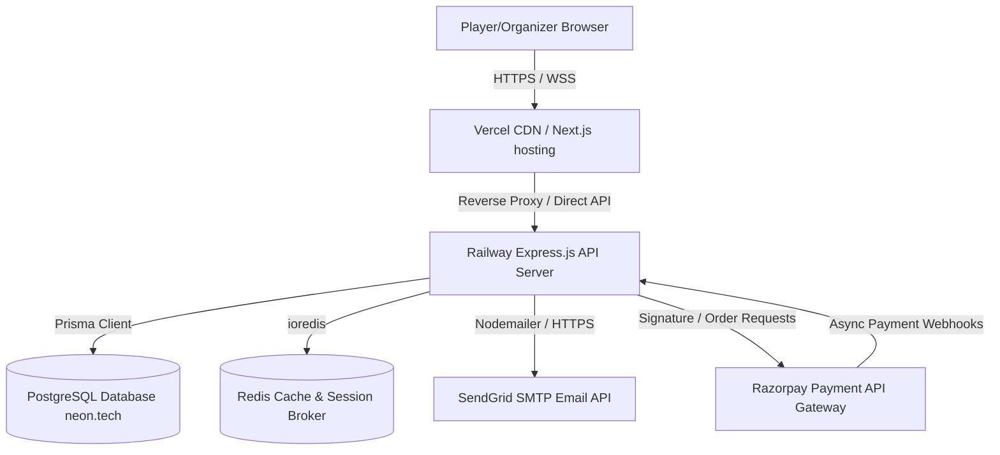

# 🏗️ PlayHive — Architecture Topology

This document details the software architecture topology, communication ports, protocol mappings, and component relationships of the PlayHive platform.

---

## 🗺️ System Topology



---

## 📈 Request Execution Life Cycle

The lifecycle of an API request to a protected endpoint (e.g., fetching user-specific payments):

```
[ Client Browser ]
  │
  ├─► 1. Send GET `/api/v1/payments/my` (with Header: "Authorization: Bearer <JWT>")
  │
  ▼
[ Express Router ]
  │
  ├─► 2. Execute rateLimiter.ts (Check request window bucket count)
  │
  ├─► 3. Execute auth.ts middleware
  │      ├─► Verify JWT signature with local secret
  │      ├─► Extract userId and attach to Request object (`req.user`)
  │      └─► Return 401 if token is expired
  │
  ├─► 4. Route handler (payments.ts) queries Database via Prisma Client
  │      └─► `prisma.payment.findMany({ where: { userId } })`
  │
  ▼
[ Database (PostgreSQL) ] Returns Payment rows
  │
  ▼
[ Express Response ] Send JSON status 200 payload back to client
```
